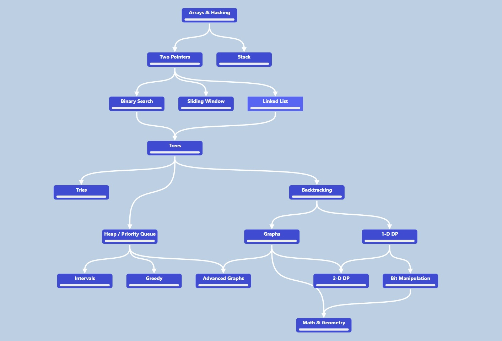

# CodingChallenges
Code Challenges based on thechnical interview questions to solve coding problems using data structures and algorithm

## Data structures

Arrays

Linked List

String

Matrix

HashMaps

Stacks

Trees

Tries

Queues

Heap

Graphs

## Algorithms

Sliding Window

Binary Search

Sorting

Top K element

Backtracking

Recursion

Dynamic Programming

Graph Traversal

Dikstra's Algorithm

Greedy Algorithm

Intervals

Math

Bit Manipulation

## Roadmap

The NeetCode proposed path for aproaching coding challanges. This roadmap is organized by topics in a systematic way and sorted by easiest to hardest.

